# DocFlow Lite 架构视图与 UML 图

## 1. 架构总原则

DocFlow Lite 的核心约束是：**每个环节都必须可扩展**。

这不是只给模型或解析器留接口，而是从 Tenant、Workspace、Schema、文档解析、样本学习、模型调用、Prompt 生成、人工纠正、结果校验、文件入口、调度、Mapping、Destination、API Access 到监控状态，每个环节都要通过接口、策略、注册表或插件点扩展。

核心设计要求：

1. Router 只处理 HTTP，不写业务规则。
2. Application Service 只编排用例，不直接绑定具体实现。
3. Domain Model 表达业务对象和状态机。
4. Provider / Connector / Adapter 负责外部能力。
5. Validator / Rule Object 表达校验规则。
6. Registry 负责选择具体实现。
7. 前端页面按 Feature 拆分，不能把所有逻辑放在单个 App 文件。

## 2. 系统上下文图

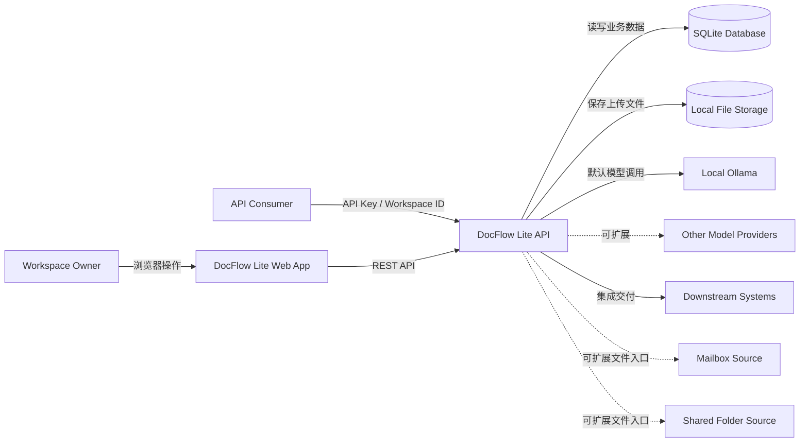

## 3. 服务架构图

```mermaid
flowchart TB
    subgraph FE[Frontend - TypeScript]
        TenantUI[Tenant Center]
        WorkspaceUI[Workspace Home]
        InitUI[Initialization Pages]
        CorrectionUI[Analysis Detail / Correction]
        IntegrationUI[Integration Workflow]
        ResultUI[Extracted Result]
        ApiAccessUI[API Access]
        ModelSettingsUI[Model Settings]
        ApiClient[Typed API Client]
    end

    subgraph API[Backend API Routers - FastAPI]
        TenantRouter[Tenant Router]
        WorkspaceRouter[Workspace Router]
        InitRouter[Initialization Router]
        CorrectionRouter[Correction Router]
        ExtractionRouter[Extraction Router]
        IntegrationRouter[Integration Router]
        ApiAccessRouter[API Access Router]
        ModelRouter[Model Settings Router]
    end

    subgraph APP[Application Services]
        TenantService[TenantService]
        WorkspaceService[WorkspaceService]
        SchemaService[SchemaService]
        TrainingService[TrainingExampleService]
        LearningService[SchemaLearningService]
        PromptService[PromptProfileService]
        CorrectionService[CorrectionService]
        ExtractionService[ExtractionService]
        IntegrationService[IntegrationService]
        ApiAccessService[ApiAccessService]
    end

    subgraph DOMAIN[Domain Layer]
        DomainModels[Domain Models]
        StateMachines[State Machines]
        Validators[Validators / Rule Objects]
        Policies[Policies]
    end

    subgraph EXT[Extension Layer]
        ParserRegistry[DocumentParserRegistry]
        ModelRegistry[ModelProviderRegistry]
        LearningRegistry[SchemaLearningStrategyRegistry]
        PromptRegistry[PromptGeneratorRegistry]
        ConnectorRegistry[FileEntranceConnectorRegistry]
        DestinationRegistry[DestinationAdapterRegistry]
        ValidatorRegistry[ValidationRuleRegistry]
    end

    subgraph INFRA[Infrastructure]
        Repositories[Repositories]
        SQLite[(SQLite)]
        FileStorage[(File Storage)]
        Ollama[OllamaProvider]
        MockModel[MockProvider]
        PdfParser[PdfParser]
        ExcelParser[ExcelParser]
        CsvParser[CsvParser]
        HttpDestination[HttpDestinationAdapter]
    end

    TenantUI --> ApiClient
    WorkspaceUI --> ApiClient
    InitUI --> ApiClient
    CorrectionUI --> ApiClient
    IntegrationUI --> ApiClient
    ResultUI --> ApiClient
    ApiAccessUI --> ApiClient
    ModelSettingsUI --> ApiClient

    ApiClient --> TenantRouter
    ApiClient --> WorkspaceRouter
    ApiClient --> InitRouter
    ApiClient --> CorrectionRouter
    ApiClient --> ExtractionRouter
    ApiClient --> IntegrationRouter
    ApiClient --> ApiAccessRouter
    ApiClient --> ModelRouter

    TenantRouter --> TenantService
    WorkspaceRouter --> WorkspaceService
    InitRouter --> SchemaService
    InitRouter --> TrainingService
    InitRouter --> LearningService
    CorrectionRouter --> CorrectionService
    ExtractionRouter --> ExtractionService
    IntegrationRouter --> IntegrationService
    ApiAccessRouter --> ApiAccessService
    ModelRouter --> PromptService

    TenantService --> DomainModels
    WorkspaceService --> DomainModels
    SchemaService --> Validators
    TrainingService --> Validators
    LearningService --> Policies
    PromptService --> Validators
    CorrectionService --> Validators
    ExtractionService --> StateMachines
    IntegrationService --> StateMachines

    LearningService --> LearningRegistry
    LearningService --> PromptRegistry
    ExtractionService --> ParserRegistry
    ExtractionService --> ModelRegistry
    IntegrationService --> ConnectorRegistry
    IntegrationService --> DestinationRegistry
    IntegrationService --> ValidatorRegistry

    TenantService --> Repositories
    WorkspaceService --> Repositories
    SchemaService --> Repositories
    TrainingService --> Repositories
    PromptService --> Repositories
    CorrectionService --> Repositories
    ExtractionService --> Repositories
    IntegrationService --> Repositories

    Repositories --> SQLite
    ParserRegistry --> PdfParser
    ParserRegistry --> ExcelParser
    ParserRegistry --> CsvParser
    PdfParser --> FileStorage
    ExcelParser --> FileStorage
    CsvParser --> FileStorage
    ModelRegistry --> Ollama
    ModelRegistry --> MockModel
    DestinationRegistry --> HttpDestination
```

## 4. 后端包图

```mermaid
classDiagram
    namespace api.routers {
      class TenantRouter
      class WorkspaceRouter
      class InitializationRouter
      class CorrectionRouter
      class ExtractionRouter
      class IntegrationRouter
      class ApiAccessRouter
      class ModelSettingsRouter
    }

    namespace application {
      class TenantService
      class WorkspaceService
      class SchemaService
      class TrainingExampleService
      class SchemaLearningService
      class PromptProfileService
      class CorrectionService
      class ExtractionService
      class IntegrationService
      class ApiAccessService
    }

    namespace domain {
      class Tenant
      class Workspace
      class SchemaDefinition
      class TrainingExample
      class CorrectionSession
      class PromptProfile
      class ExtractionTask
      class IntegrationWorkflow
      class ValidationIssue
      class StateMachine
    }

    namespace infrastructure.repositories {
      class TenantRepository
      class WorkspaceRepository
      class SchemaRepository
      class TrainingExampleRepository
      class CorrectionSessionRepository
      class PromptProfileRepository
      class ExtractionTaskRepository
      class IntegrationWorkflowRepository
    }

    namespace infrastructure.extensions {
      class DocumentParserRegistry
      class ModelProviderRegistry
      class SchemaLearningStrategyRegistry
      class PromptGeneratorRegistry
      class FileEntranceConnectorRegistry
      class DestinationAdapterRegistry
      class ValidationRuleRegistry
    }

    TenantRouter --> TenantService
    WorkspaceRouter --> WorkspaceService
    InitializationRouter --> SchemaService
    InitializationRouter --> TrainingExampleService
    InitializationRouter --> SchemaLearningService
    CorrectionRouter --> CorrectionService
    ExtractionRouter --> ExtractionService
    IntegrationRouter --> IntegrationService
    ApiAccessRouter --> ApiAccessService

    TenantService --> TenantRepository
    WorkspaceService --> WorkspaceRepository
    SchemaService --> SchemaRepository
    TrainingExampleService --> TrainingExampleRepository
    CorrectionService --> CorrectionSessionRepository
    PromptProfileService --> PromptProfileRepository
    ExtractionService --> ExtractionTaskRepository
    IntegrationService --> IntegrationWorkflowRepository

    SchemaLearningService --> ModelProviderRegistry
    SchemaLearningService --> SchemaLearningStrategyRegistry
    SchemaLearningService --> PromptGeneratorRegistry
    ExtractionService --> DocumentParserRegistry
    ExtractionService --> ModelProviderRegistry
    IntegrationService --> FileEntranceConnectorRegistry
    IntegrationService --> DestinationAdapterRegistry
    IntegrationService --> ValidationRuleRegistry
```

## 5. 前端包图

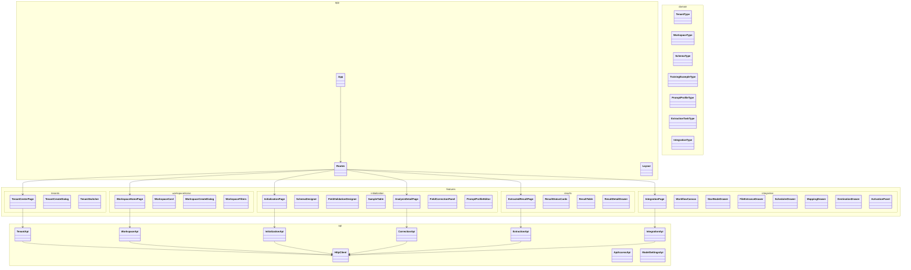

## 6. 组件图

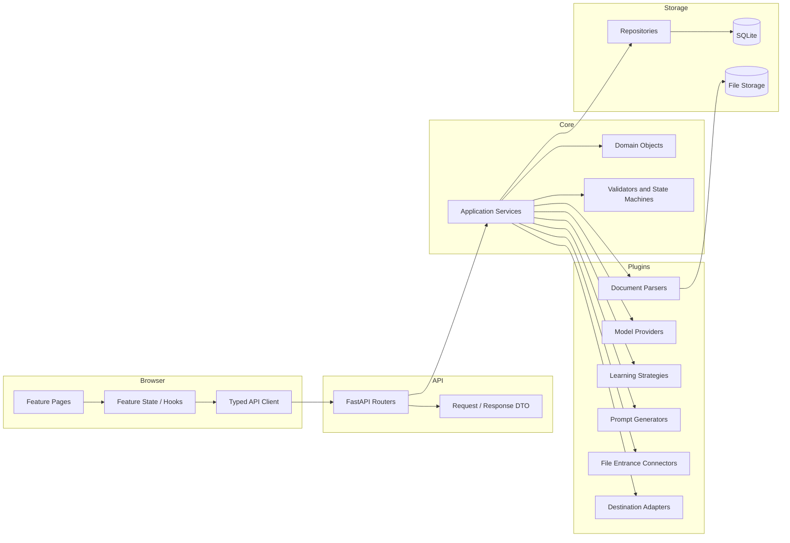

## 7. 初始化学习闭环时序图

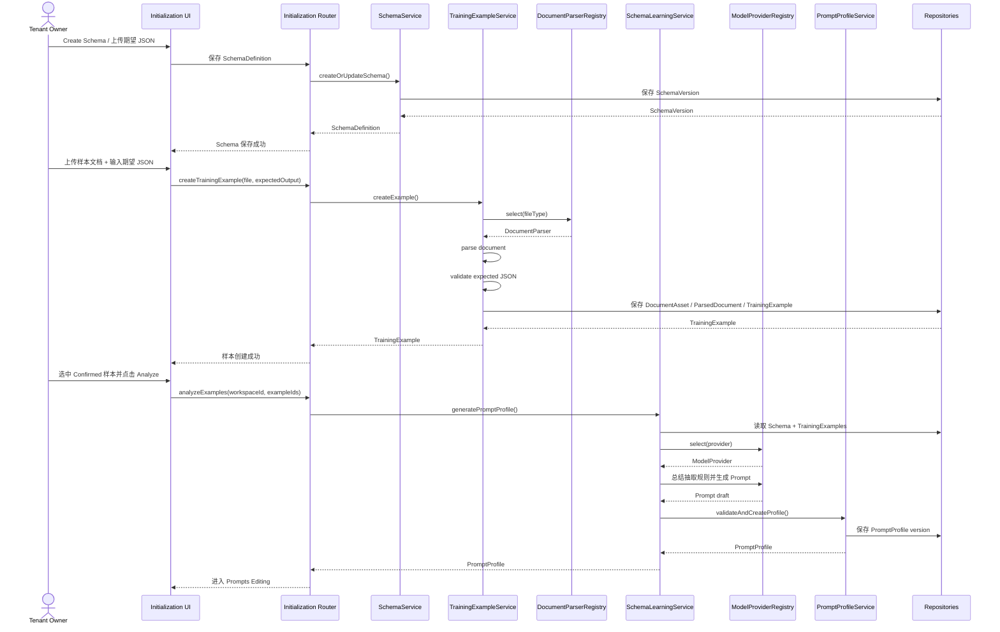

## 8. 字段级纠正时序图

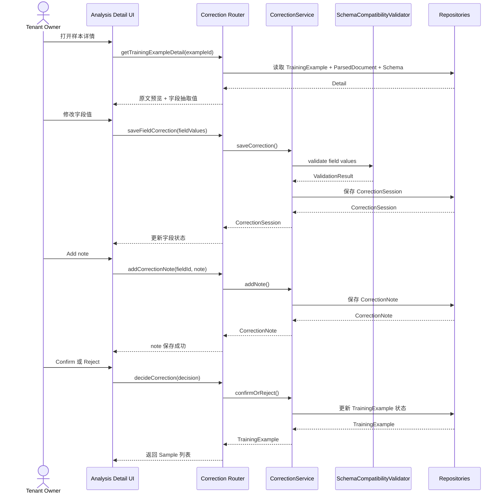

## 9. 正式文档同步抽取时序图

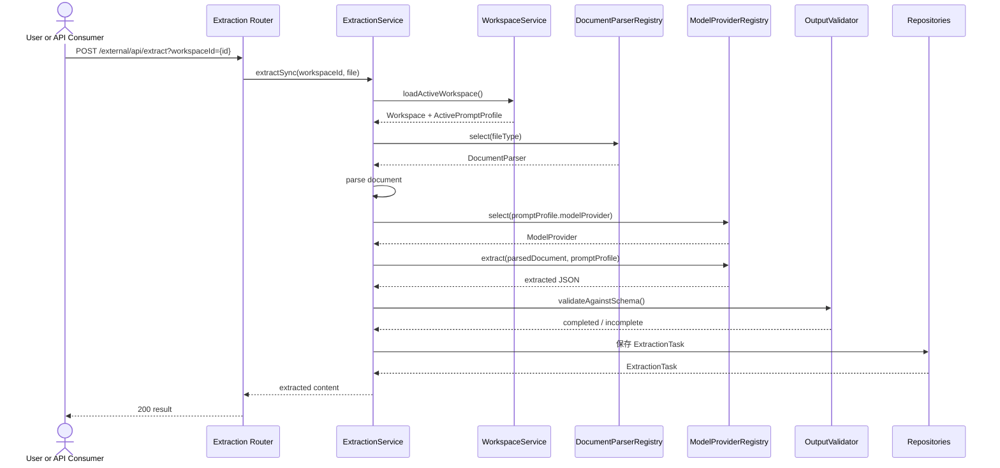

## 10. 正式文档异步抽取时序图

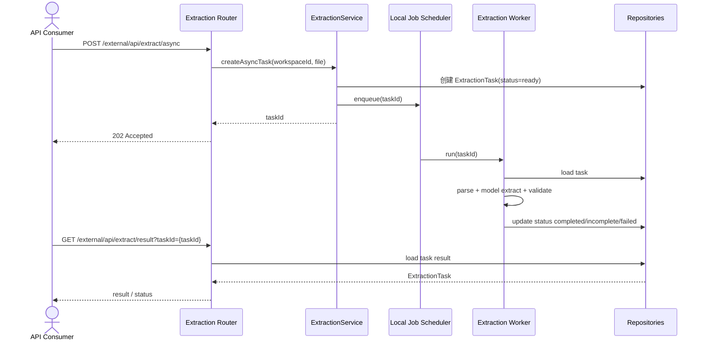

## 11. Integration 激活时序图

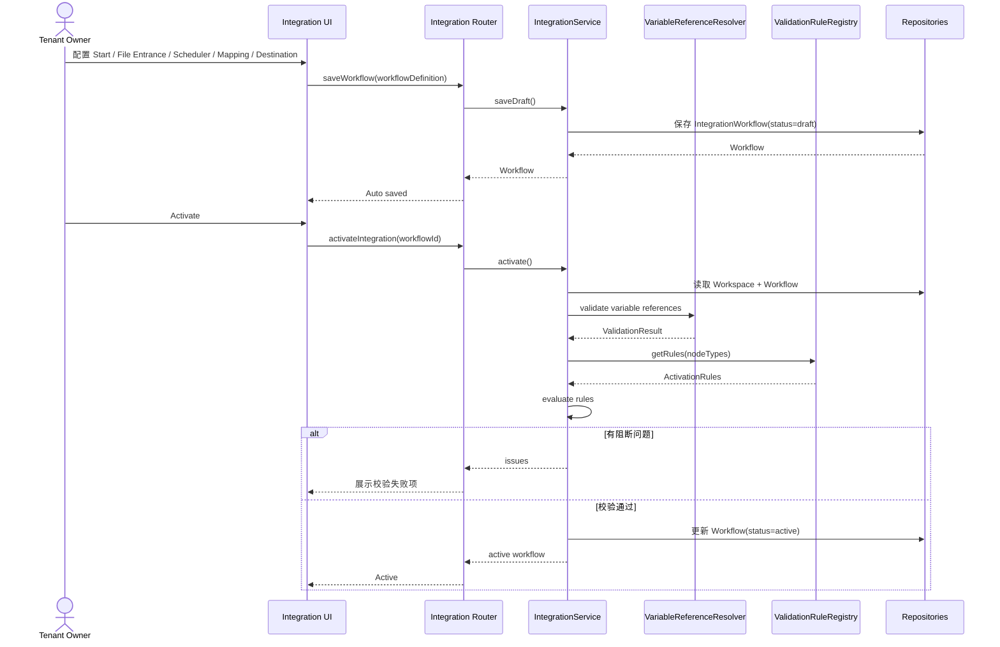

## 12. 数据流图：初始化学习

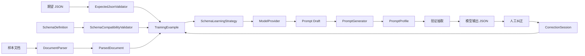

## 13. 数据流图：正式抽取与集成

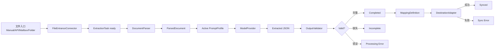

## 14. 数据库 ER 图

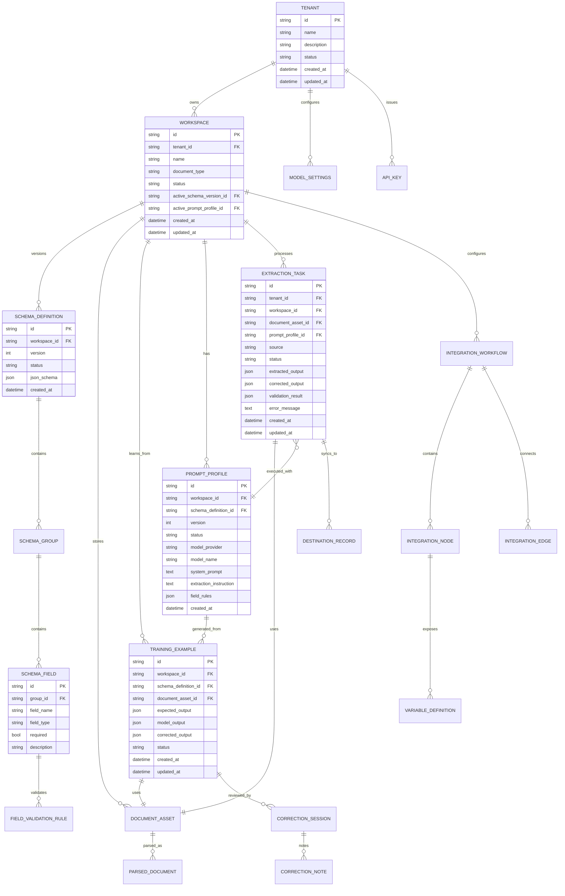

## 15. Workspace 状态机图

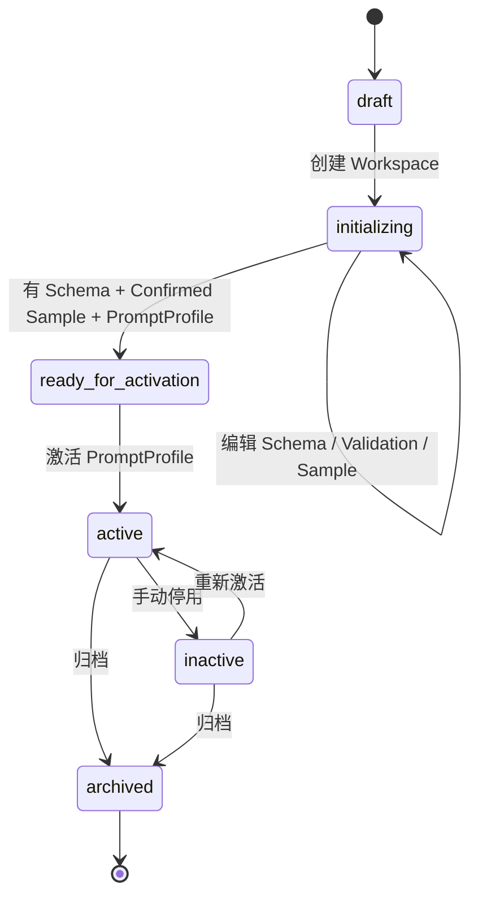

## 16. Training Example 状态机图

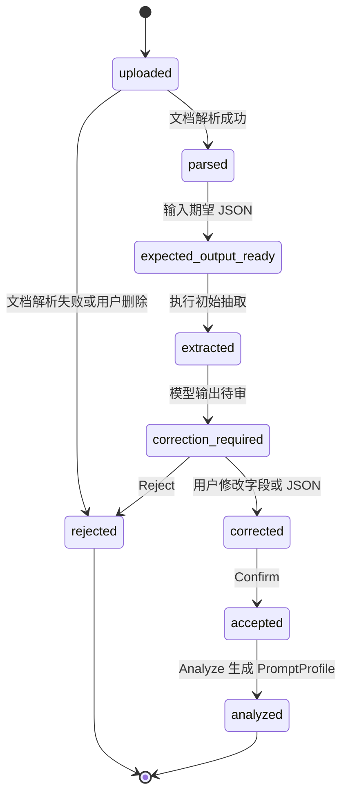

## 17. Prompt Profile 状态机图

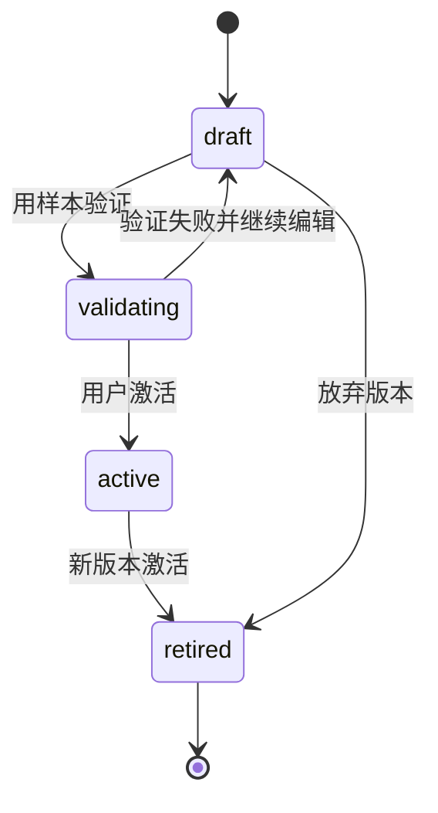

## 18. Extraction Task 状态机图

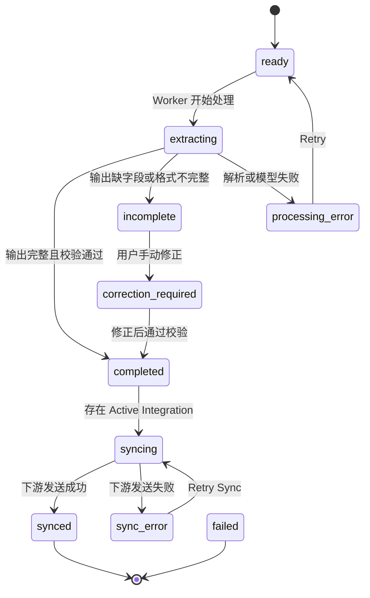

## 19. Integration Workflow 状态机图

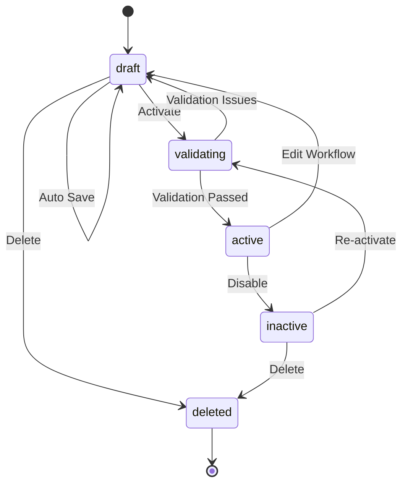

## 20. 部署图

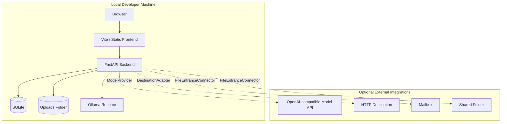

## 21. 端到端扩展点图

```mermaid
flowchart LR
    Tenant[Tenant Lifecycle]
    Workspace[Workspace Lifecycle]
    Schema[Schema Definition]
    Validation[Field Validation]
    Upload[Document Upload]
    Preflight[Large File Preflight]
    Parse[Document Parsing]
    Chunk[Document Chunking]
    Context[Context Package]
    Expected[Expected JSON]
    Learn[Schema Learning]
    Prompt[Prompt Generation]
    Extract[Extraction]
    Correct[Correction]
    Activate[Activation]
    Entrance[File Entrance]
    Schedule[Scheduler]
    Mapping[Mapping]
    Destination[Destination]
    ApiAccess[API Access]

    Tenant --> Workspace --> Schema --> Validation --> Upload --> Preflight --> Parse --> Chunk --> Context --> Expected --> Learn --> Prompt --> Extract --> Correct --> Activate --> Entrance --> Schedule --> Mapping --> Destination --> ApiAccess

    Tenant -.TenantPolicy.-> TenantExt[Tenant Extension]
    Workspace -.WorkspaceTemplate.-> WorkspaceExt[Workspace Template Extension]
    Schema -.SchemaImporter.-> SchemaExt[Schema Importer Extension]
    Validation -.ValidationRule.-> ValidationExt[Validation Rule Extension]
    Upload -.FileEntranceConnector.-> UploadExt[File Source Extension]
    Preflight -.LargeDocumentPolicy.-> PreflightExt[Large File Policy Extension]
    Parse -.DocumentParser.-> ParseExt[Parser Extension]
    Chunk -.ChunkingStrategy.-> ChunkExt[Chunking Extension]
    Context -.ContextAssemblyStrategy.-> ContextExt[Context Assembly Extension]
    Learn -.SchemaLearningStrategy.-> LearnExt[Learning Strategy Extension]
    Prompt -.PromptGenerator.-> PromptExt[Prompt Generator Extension]
    Extract -.ModelProvider.-> ExtractExt[Model Provider Extension]
    Correct -.CorrectionPolicy.-> CorrectExt[Correction Policy Extension]
    Activate -.ActivationRule.-> ActivateExt[Activation Rule Extension]
    Mapping -.MappingTransformer.-> MappingExt[Mapping Extension]
    Destination -.DestinationAdapter.-> DestinationExt[Destination Extension]
    ApiAccess -.ApiAuthStrategy.-> ApiAccessExt[API Auth Extension]
```

## 22. 大文件处理服务架构图

```mermaid
flowchart TB
    Upload[Upload / API Input] --> Ingestion[DocumentIngestionService]
    Ingestion --> Asset[(DocumentAsset)]
    Ingestion --> Policy[LargeDocumentPolicy]
    Policy -->|sync allowed| SmallPlan[Single Pass ExtractionPlan]
    Policy -->|async required| AsyncTask[Async ExtractionTask]
    Policy -->|rejected| PreflightIssue[Preflight ValidationIssue]

    AsyncTask --> ParserRegistry[DocumentParserRegistry]
    ParserRegistry --> Parsed[(ParsedDocument)]
    Parsed --> Normalizer[DocumentNormalizer]
    Normalizer --> Segment[(DocumentSegment)]
    Segment --> ChunkRegistry[ChunkingStrategyRegistry]
    ChunkRegistry --> Chunk[(DocumentChunk)]
    Chunk --> Index[Local Content Index]

    SmallPlan --> ContextService[ContextEngineeringService]
    Index --> Retrieval[RetrievalStrategy]
    Retrieval --> Planner[ExtractionPlanningService]
    Planner --> ContextService
    ContextService --> TokenBudgeter[TokenBudgeter]
    ContextService --> Context[(ContextPackage)]
    Context --> ModelRegistry[ModelProviderRegistry]
    ModelRegistry --> Invocation[(ModelInvocation)]
    Invocation --> Merger[ExtractionMergeService]
    Merger --> Validation[Schema + Field Validation]
    Validation --> Result[(Extraction Result)]
```

## 23. 大文件抽取时序图

```mermaid
sequenceDiagram
    actor User
    participant UI as Frontend
    participant API as Extraction Router
    participant Ingestion as DocumentIngestionService
    participant Policy as LargeDocumentPolicy
    participant Parser as DocumentParserRegistry
    participant Chunker as ChunkingStrategyRegistry
    participant Planner as ExtractionPlanningService
    participant Context as ContextEngineeringService
    participant Model as ModelProvider
    participant Merger as ExtractionMergeService
    participant Repo as Repositories

    User->>UI: Upload large PDF
    UI->>API: POST async extract
    API->>Ingestion: create document asset
    Ingestion->>Repo: save DocumentAsset metadata and file path
    Ingestion->>Policy: preflight size/pages/type
    Policy-->>Ingestion: async_required
    Ingestion->>Repo: create ExtractionTask uploaded/preflighted
    API-->>UI: task id

    Ingestion->>Parser: parse document
    Parser-->>Ingestion: ParsedDocument
    Ingestion->>Chunker: create chunks
    Chunker-->>Ingestion: DocumentChunk list
    Ingestion->>Repo: save ParsedDocument and chunks
    Ingestion->>Planner: build staged extraction plan
    Planner-->>Ingestion: ExtractionPlan

    loop each ExtractionPass
        Ingestion->>Context: assemble ContextPackage
        Context-->>Ingestion: budgeted prompt and chunk references
        Ingestion->>Model: invoke with ContextPackage
        Model-->>Ingestion: partial JSON
        Ingestion->>Repo: save ModelInvocation and pass output
    end

    Ingestion->>Merger: merge partial outputs
    Merger-->>Ingestion: merged JSON with conflicts
    Ingestion->>Repo: save validation result and final status
    UI->>API: GET task result
    API-->>UI: output, trace, chunk sources, issues
```

## 24. 模型上下文控制数据流图

```mermaid
flowchart LR
    Schema[Schema Contract] --> Budgeter[TokenBudgeter]
    Prompt[PromptProfile] --> Budgeter
    Rules[Field Rules] --> Budgeter
    Examples[Few-shot Examples] --> Budgeter
    Chunks[Candidate DocumentChunks] --> Retriever[RetrievalStrategy]
    TargetFields[Target Field Group] --> Retriever
    Retriever --> CandidateChunks[Ranked Candidate Chunks]
    Budgeter --> ContextAssembler[ContextAssemblyStrategy]
    CandidateChunks --> ContextAssembler
    ContextAssembler --> ContextPackage[(ContextPackage)]
    ContextPackage --> Validator[ContextBudgetValidator]
    Validator -->|valid| ModelCall[Model Invocation]
    Validator -->|over budget| Degrade[Reduce Examples / Field Group / Chunk Count]
    Degrade --> ContextAssembler
    Validator -->|cannot fit| Issue[context_budget_exceeded issue]
```

## 25. 大文件 ER 扩展图

```mermaid
erDiagram
    DOCUMENT_ASSET ||--o{ PARSED_DOCUMENT : parsed_as
    PARSED_DOCUMENT ||--o{ DOCUMENT_SEGMENT : contains
    DOCUMENT_SEGMENT ||--o{ DOCUMENT_CHUNK : chunked_into
    EXTRACTION_TASK ||--o{ EXTRACTION_PLAN : planned_by
    EXTRACTION_PLAN ||--o{ EXTRACTION_PASS : contains
    EXTRACTION_PASS ||--|| CONTEXT_PACKAGE : uses
    CONTEXT_PACKAGE }o--o{ DOCUMENT_CHUNK : includes
    CONTEXT_PACKAGE ||--o{ MODEL_INVOCATION : invokes
    EXTRACTION_PASS ||--o{ EXTRACTION_CHUNK_RESULT : produces
    EXTRACTION_TASK ||--o{ EXTRACTION_MERGE_RESULT : merged_as

    DOCUMENT_ASSET {
      string id PK
      string workspace_id FK
      string mime_type
      int size_bytes
      string sha256
      string storage_path
      int page_count
      string processing_mode
      string preflight_status
    }

    DOCUMENT_CHUNK {
      string id PK
      string parsed_document_id FK
      int chunk_index
      string chunk_type
      string source_range
      int token_count
      text content
      json semantic_hints
    }

    CONTEXT_PACKAGE {
      string id PK
      string workspace_id FK
      string prompt_profile_id FK
      string extraction_task_id FK
      json target_fields
      json chunk_ids
      int token_budget
      int estimated_input_tokens
      int reserved_output_tokens
      string assembly_strategy
    }

    MODEL_INVOCATION {
      string id PK
      string context_package_id FK
      string provider
      string model_name
      int estimated_input_tokens
      int estimated_output_tokens
      int duration_ms
      string status
      text error_message
    }
```

## 26. 大文件处理状态机图

```mermaid
stateDiagram-v2
    [*] --> uploaded
    uploaded --> preflighted
    preflighted --> rejected_by_policy
    preflighted --> sync_allowed
    preflighted --> async_required
    sync_allowed --> extracting
    async_required --> parsing
    parsing --> chunking
    chunking --> indexing
    indexing --> planning
    planning --> assembling_context
    assembling_context --> extracting
    extracting --> merging
    merging --> validating
    validating --> completed
    validating --> correction_required
    parsing --> failed
    chunking --> failed
    assembling_context --> failed
    extracting --> failed
    merging --> failed
    failed --> retrying
    retrying --> parsing
    retrying --> assembling_context
    retrying --> extracting
    correction_required --> completed
```
